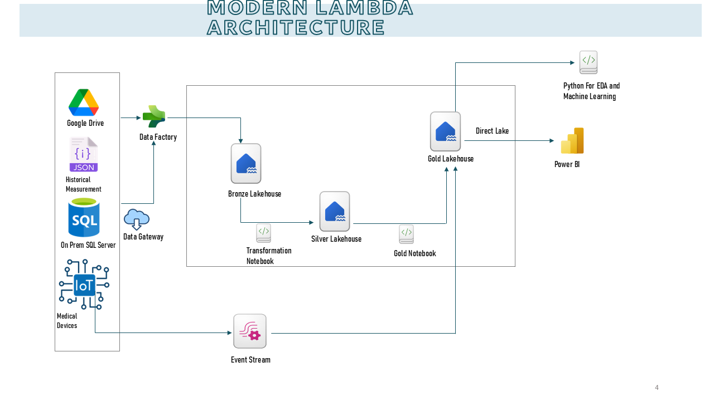

# Merridian Medical Data Center Analytics Transformation
## 📌 Overview

Meridian Medical Data Center (MMDC) is transforming its healthcare data infrastructure with a **modern Lambda Architecture with Medallion Principles** using **Microsoft Fabric**. This project integrates batch and streaming data to provide real-time insights, predictive analytics, and optimized resource management.

---

## 🏗️ **Architecture Overview**

### **High-Level Architecture**

Your architecture follows a **modernized Lambda Architecture** with **Medallion (Bronze, Silver, Gold) principles**:

- **Batch Data Flow:** Data moves through **Bronze → Silver → Gold** layers for historical analytics.
- **Streaming Data Flow:** IoT medical data is **processed in real-time** and directly stored in **Gold Lakehouse**.
- **Consumption Layer:** Power BI (Direct Lake) and Python notebooks provide analytics & machine learning insights.

📌 **Insert the Architecture Diagram here** 

---

## 🏛️ **Project Structure**

```
📂 MMDC-Analytics-Platform
├── 📁 data_ingestion
│   ├── azure_data_factory_pipelines/
│   ├── event_stream_config/
│   └── batch_ingestion_scripts/
├── 📁 data_processing
│   ├── notebooks/
│   ├── transformation_scripts/
│   └── machine_learning_models/
├── 📁 dashboards
│   ├── power_bi_reports/
│   └── streaming_visuals/
├── 📁 docs
│   ├── architecture.md
│   ├── setup_guide.md
│   ├── data_flow.md
│   ├── analytics_approach.md
│   └── troubleshooting.md
├── 📁 images
│   ├── architecture.png
│   ├── power_bi_dashboard.png
│   ├── streaming_data_pipeline.png
├── README.md
└── LICENSE
```


## 📥 **Data Sources & Ingestion**

MMDC integrates data from multiple sources:

| Source              | Type               | Ingestion Method              |
| ------------------- | ------------------ | ----------------------------- |
| Google Drive        | Batch (JSON)       |  Data Factory            |
| SQL Server          | Batch (Structured) |  Data Factory            |
| IoT Medical Devices | Streaming          | Microsoft Fabric Event Stream |

- **Batch Data** is loaded into **Bronze Lakehouse** and transformed into **Silver & Gold**.
- **Streaming Data** flows **directly into Gold** for **real-time analytics**.

📌 

---

## 🔀 **Data Model & Storage Layers**

MMDC follows a **Lambda architecture** for data organization:

### **Batch Data Layers**

1. **Bronze Layer:** Raw data from batch sources.
2. **Silver Layer:** Cleaned & structured data.
3. **Gold Layer:** Aggregated & analytics-ready data.

### **Streaming Data Flow**

- **IoT streaming data goes directly to Gold Lakehouse**.
- **Event Stream processes and forwards real-time records**.

📌 **Insert Lambda Architecture Diagram here** 

---

## 📊 **Analytics & Reporting**

### **Power BI Dashboards**

- Encounter Analytics
- Clinical Measurements Insights
- Real-Time Streaming Visualizations

### **Machine Learning Models**

- **Predicting Healthcare Costs**: Using a **Random Forest model**, MMDC is now able to predict healthcare costs accurately based on patient encounter records, diagnosis information, and resource utilization.
  
  **Model Metrics:**
  - **R² Score (0.69)**: Indicates that the model explains 69% of the variance in healthcare costs.
  - **MAE (616.67)**: On average, predictions are off by 616 units, manageable but indicating areas for improvement.
  - **RMSE (792.06)**: Larger errors are observed in some predictions, requiring further refinement.
  
- **Forecasting patient readmission rates.**
- **Forecasting resource utilization.**
- **Anomaly detection for patient vitals.**


---

## 🛠️ **Setup Guide**

### **1️⃣ Prerequisites**

- Azure/Fabric Subscription (Fabric, Data Factory, Event Stream, Fabric Notebooks)
- Power BI
- Python 3.8+ for ML Notebooks

### **2️⃣ Deployment Steps**

1. **Set up Data Factory pipelines**
2. **Configure Event Stream for IoT data**
3. **Deploy Lakehouse storage & Notebooks**
4. **Connect Power BI to Gold Lakehouse**


---

## 🚀 **Expected Outcomes**

✅ Real-time patient monitoring.  
✅ Optimized hospital resource allocation.  
✅ Advanced predictive healthcare analytics, especially in healthcare cost forecasting.

---

## 📜 **License**

This project is licensed under the MIT License - see the LICENSE file for details.

---

## 🤝 **Contributing**

Contributions are welcome! Please follow the guidelines in `CONTRIBUTING.md`.

📌 **Include a **``** file in **``


---

---

